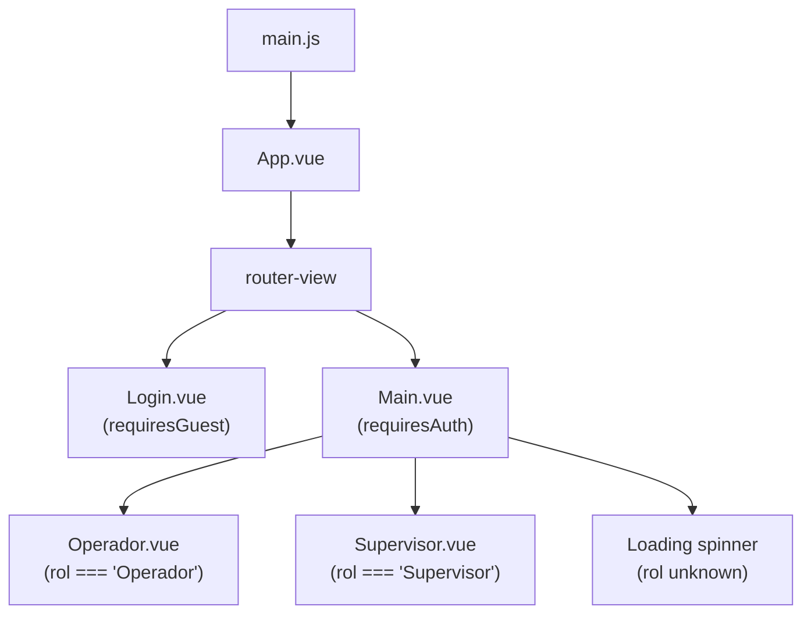
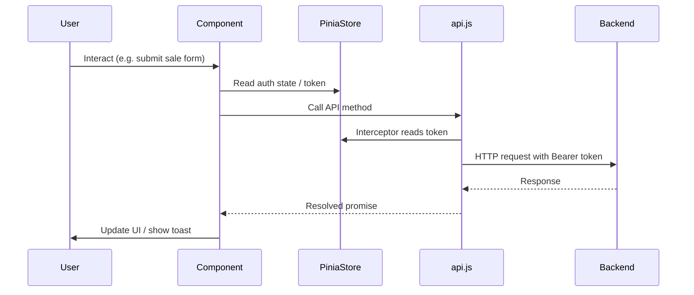

Orion GoNet is a single-page application built with Vue 3. The application bootstraps with Pinia for state management, Vue Router for navigation, and vue-toastification for notifications. All routing is client-side, and authentication state is hydrated from `localStorage` before the app mounts.

## Bootstrap sequence

<Steps>
  <Step title="Create the Vue app">
    `createApp(App)` initializes the root component.
  </Step>
  <Step title="Register plugins">
    Pinia, Vue Router, and vue-toastification are installed via `app.use()`.
  </Step>
  <Step title="Hydrate auth state">
    `authStore.cargarRolDesdeToken()` runs immediately after plugin registration. It reads the JWT from `localStorage`, decodes the `Role` claim, and sets the Pinia auth state before the first render.
  </Step>
  <Step title="Mount">
    `app.mount('#app')` attaches the application to the DOM.
  </Step>
</Steps>

```javascript main.js
import { createApp } from 'vue'
import { createPinia } from 'pinia'
import App from './App.vue'
import router from './router'
import Toast from 'vue-toastification'
import 'vue-toastification/dist/index.css'

const app = createApp(App)
app.use(createPinia())
app.use(router)
app.use(Toast)

import { useAuthStore } from './stores/auth'
const authStore = useAuthStore()
authStore.cargarRolDesdeToken()

app.mount('#app')
```

<Note>
  `cargarRolDesdeToken()` must be called after `app.use(createPinia())` because Pinia must be active before any store is accessed.
</Note>

## Component tree



`App.vue` renders a single `<router-view>`. The router resolves to either `Login` or `Main` depending on the current route and authentication state. `Main` then conditionally renders `Operador` or `Supervisor` based on the role decoded from the JWT.

## Router and navigation guards

Routes are defined with meta fields that the global `beforeEach` guard evaluates on every navigation.

```javascript src/router/index.js
const router = createRouter({
  history: createWebHistory(import.meta.env.BASE_URL),
  routes: [
    { path: '/login', name: 'login', component: Login, meta: { requiresGuest: true } },
    { path: '/main',  name: 'main',  component: Main,  meta: { requiresAuth: true } },
    { path: '/',                  redirect: '/login' },
    { path: '/:pathMatch(.*)*',   redirect: '/login' }
  ]
})

router.beforeEach((to, from, next) => {
  const authStore = useAuthStore()
  const isAuthenticated = authStore.isAuthenticated
  if (to.meta.requiresAuth && !isAuthenticated) {
    next('/login')
  } else if (to.meta.requiresGuest && isAuthenticated) {
    next('/main')
  } else {
    next()
  }
})
```

| Meta field | Routes | Behaviour |
|---|---|---|
| `requiresAuth` | `/main` | Redirects unauthenticated users to `/login` |
| `requiresGuest` | `/login` | Redirects authenticated users to `/main` |
| _(none)_ | `/`, `/*` | Redirects to `/login` unconditionally |

## State management

Pinia is the single source of truth for application state. The platform currently defines one store.

<CardGroup cols={1}>
  <Card title="auth store" icon="shield" href="/concepts/authentication">
    Located at `src/stores/auth.js`. Manages the JWT token, decoded role, login/logout actions, and the `isAuthenticated` getter. See the Authentication page for full source.
  </Card>
</CardGroup>

## Utility layer

<Columns cols={3}>
  <Card title="api.js" icon="network-wired">
    Axios instance with a request interceptor that attaches the `Authorization: Bearer <token>` header to every outbound request.
  </Card>
  <Card title="cifrado.js" icon="lock">
    AES encryption helpers (`cifrarAES` / `descifrarAES`) built on CryptoJS. Used by `Operador` to encrypt card data before it is sent to the API.
  </Card>
  <Card title="historial.js" icon="clock-rotate-left">
    `localStorage`-backed operation history. Persists transaction records client-side so supervisors can review and export them.
  </Card>
</Columns>

## Data flow


