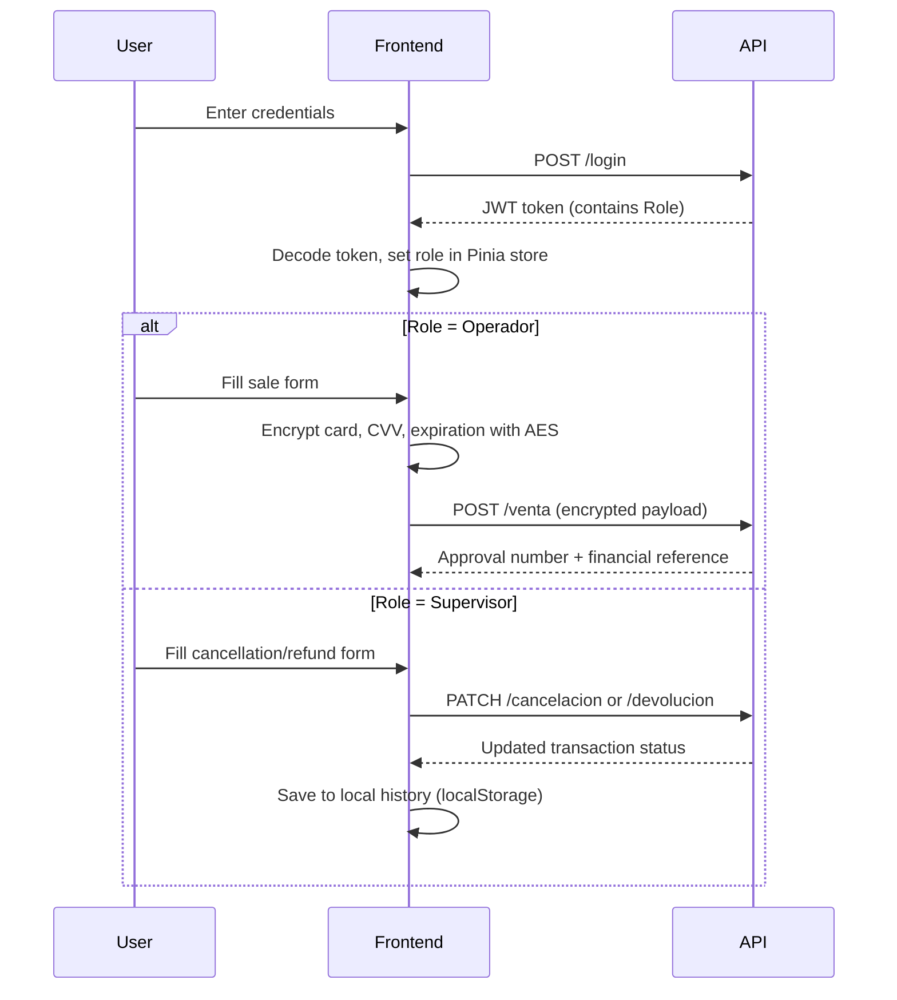

<CardGroup cols={2}>
  <Card title="Quick Start" icon="rocket" href="/quickstart">
    Get up and running in minutes — install, configure, and process your first transaction
  </Card>
  <Card title="Architecture" icon="sitemap" href="/concepts/architecture">
    Understand how the Vue 3 frontend, Pinia state management, and API layer fit together
  </Card>
  <Card title="Operator Panel" icon="credit-card" href="/features/operator-panel">
    Process sales and query approved transactions with AES-encrypted card data
  </Card>
  <Card title="Supervisor Panel" icon="shield-check" href="/features/supervisor-panel">
    Apply cancellations and refunds with justification tracking and full history export
  </Card>
</CardGroup>

## What is Orion GoNet Platform?

Orion GoNet Platform is a Vue 3 single-page application for financial transaction management. It provides a secure, role-aware interface for processing card payments, cancellations, and refunds — all with AES end-to-end encryption on sensitive card data before it ever leaves the browser.

The platform is designed for two distinct user roles:

- **Operators** — Process new sales and query existing approved transactions
- **Supervisors** — Apply cancellations and refunds, with mandatory justification and a full exportable audit log

## Key features

<CardGroup cols={2}>
  <Card title="AES Encryption" icon="lock">
    Card numbers, CVV codes, and expiration dates are encrypted with AES before transmission — sensitive data never travels in plaintext
  </Card>
  <Card title="JWT Role Access" icon="key">
    JWT tokens carry the user role (`Operador` or `Supervisor`) and control which panels and API endpoints are accessible
  </Card>
  <Card title="Real-time Feedback" icon="bell">
    Toast notifications provide immediate feedback on every operation success or failure, including HTTP status codes
  </Card>
  <Card title="Card Masking" icon="eye-slash">
    Card numbers are displayed with the middle 8 digits masked — only the first and last 4 digits are visible at rest
  </Card>
  <Card title="Operation History" icon="clock-rotate-left">
    Supervisors maintain a local history of every cancellation and refund, filterable by type or reference number
  </Card>
  <Card title="Excel Export" icon="file-excel">
    The full operation history can be exported to an `.xlsx` file with one click using the SheetJS library
  </Card>
  <Card title="Dark / Light Theme" icon="sun">
    A persistent theme toggle is available on every screen — the interface adapts to both dark and light environments
  </Card>
  <Card title="Responsive UI" icon="mobile">
    The layout adapts to mobile viewports — the branding panel hides on small screens for a clean, focused form
  </Card>
</CardGroup>

## How it works

## Technology stack

| Layer | Technology |
|---|---|
| Framework | Vue 3 (Composition API) |
| State management | Pinia |
| Routing | Vue Router 4 |
| HTTP client | Axios |
| Encryption | CryptoJS (AES) |
| Auth tokens | jwt-decode |
| Notifications | vue-toastification |
| Excel export | SheetJS (xlsx) |
| Build tool | Vite 6 |
